# Examen - RA6: Creació i Gestió d'un Projecte Web amb Git i Desplegament en Vercel

## Instruccions
### 1. Configuració inicial

1. 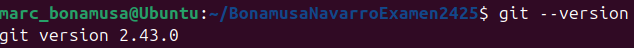
3. 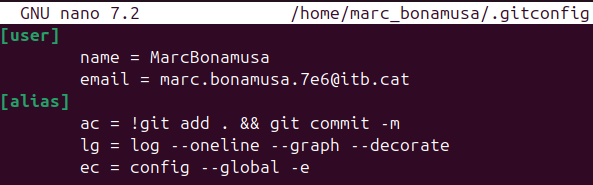
4. 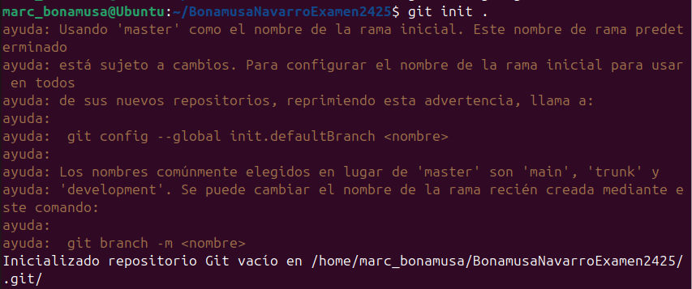
5. 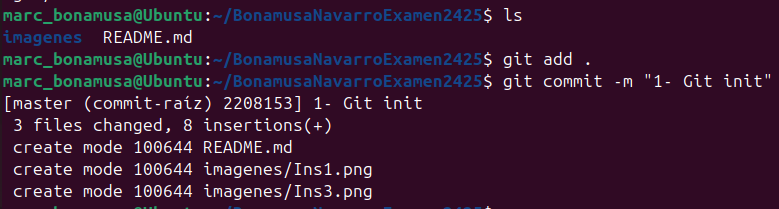

### 2. Creació del projecte web

1. 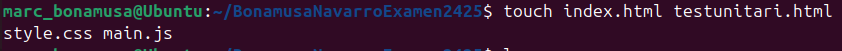
2. 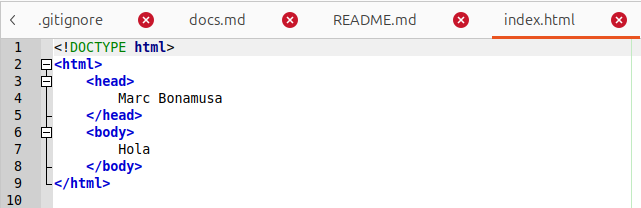
2. 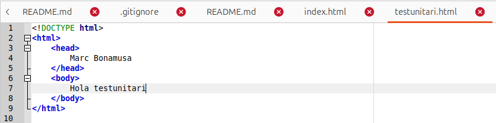
2. 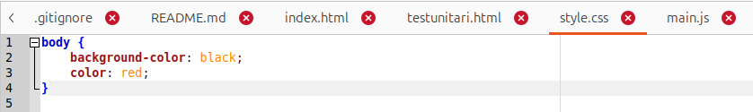
2. 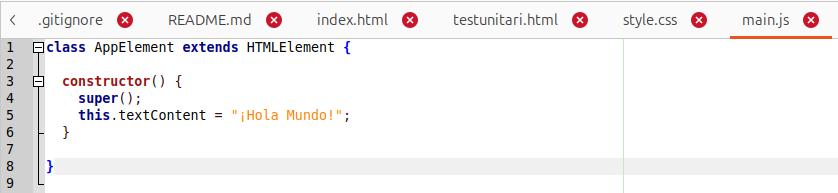

### 3. Gestió amb Git

1. 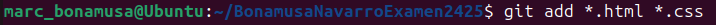
2. 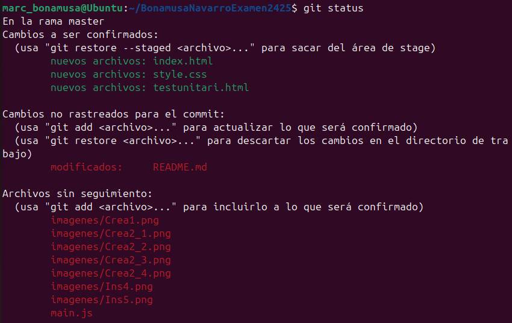
3. 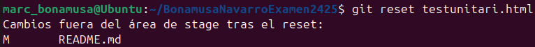
4. 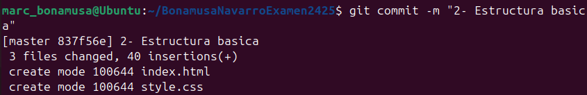
5. 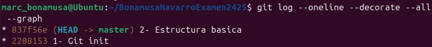

### 4. Creació de branques i documentació

1. 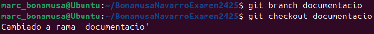
2. El propòsit del projecte es aprendre a utilitzar git i totes les seves funcionalitats
3. 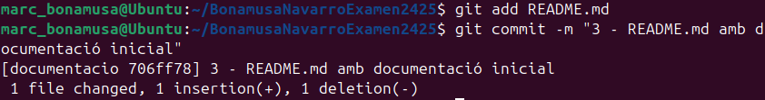
4. 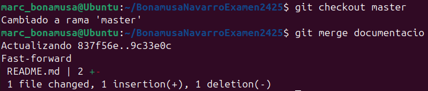

### 5. Remot i publicació

1. 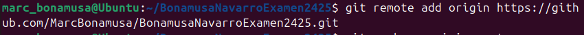
2. 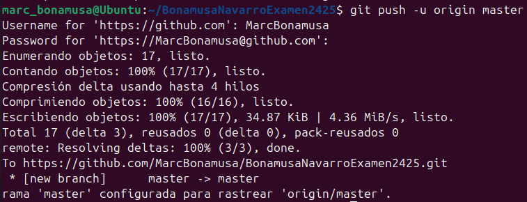
3. 
